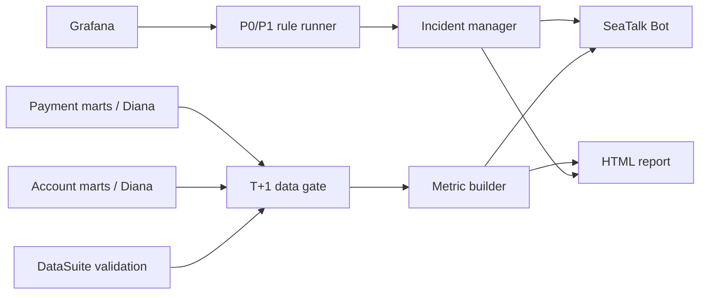

# OB Operations Monitoring Platform V1 Lite — Design

**Status:** Approved for implementation planning  
**Date:** 2026-07-17  
**Owner:** OB PM / Ops  
**Pilot regions:** ID, MY, TH, VN  

## 1. Summary

V1 Lite delivers the smallest useful OB monitoring loop: a four-region T+1 operations report, critical P0/P1 Grafana alerts, SeaTalk handling actions and data-readiness protection. It focuses on SPM/APM outbound payments and SPBA/APBA payout bank accounts.

Compared with the original proposal, V1 Lite removes roughly half of the monitoring surface and advanced rule capabilities so the first release can be delivered and validated in approximately three to four weeks.

## 2. Users and outcomes

Primary users are OB PM, OB On-call and ID/MY/TH/VN Local Ops.

V1 Lite must enable them to:

- Receive one daily report at 10:00 BJT for the previous business day.
- See which region, module, bank or channel requires attention.
- Receive immediate SeaTalk notification for critical P0/P1 degradation.
- ACK, start and mark an incident recovered.
- Distinguish missing/late data from a real business failure.
- Open the relevant Grafana or DataSuite dashboard for investigation.

## 3. Scope reduction

### 3.1 Included

- ID, MY, TH and VN.
- SPM/APM payment volume, successful volume, success rate and USD amount.
- Failed-payment distribution and pending aging where available.
- Channel, bank and error-category breakdown for payment exceptions.
- SPBA/APBA new, active, verified/checked, rejected and banned account metrics.
- Minute-level Grafana P0/P1 rules.
- T+1 partition, freshness and dashboard-update validation.
- Daily HTML report and SeaTalk summary.
- Incident states: `OPEN → ACK → IN_PROGRESS → RECOVERED`.
- Incident deduplication, minimal owner assignment and recovery tracking.
- Grafana and DataSuite drilldown links.

### 3.2 Removed from V1 Lite

- Frontend view/impression/click marts and funnel metrics.
- All TMS tracker/ticket ingestion.
- IS Giro, Remittance and bank-to-gateway routing analysis.
- P2/P3 alerts and the full action-queue UI.
- Seven-day/28-day dynamic baselines.
- Automatic threshold tuning.
- Complex cross-layer automatic root-cause analysis.
- Weekly reports, rule-management UI and multi-level escalation workflow.
- Automatic production remediation such as channel switching.

Removed items may be reconsidered only after V1 Lite meets its acceptance criteria.

## 4. Data sources and freshness

### 4.1 Real-time source

- [SPM Outbound Grafana folder](https://grafana.shopee.io/dashboards/f/jWl_-i3Sk/spm-outbound)
- [Outbound DOD](https://grafana.shopee.io/d/pFz_MiYHz/outbound-dod?from=now-2d&orgId=22&to=now&var-app=shopeepay&var-datasource=fe-gateway-live&var-platform=All&var-range=1d&var-region=All)

Grafana supplies QPS, success rate, latency, errors, pending and channel-health signals. Only reviewed dashboard/panel queries may be registered.

### 4.2 T+1 payment sources

- Preferred wide table: `mart_dwd_wide_outbound_{spm/apm}_payment_flow_df__${region}` — [documentation](https://confluence.shopee.io/pages/viewpage.action?pageId=2654871834)
- Payment source: `mart_dwd_outbound_{spm/apm}_payment_source_tab_df__${region}` — [documentation](https://confluence.shopee.io/pages/viewpage.action?pageId=2656416174)
- Payment: `mart_dwd_outbound_{spm/apm}_payment_tab_df__${region}` — [documentation](https://confluence.shopee.io/pages/viewpage.action?pageId=2650719461)

The wide table is used first when its fields and freshness satisfy the metric. Single-topic tables are validation/fallback sources.

### 4.3 T+1 account sources

- SPBA: `mart_dim_spm_payout_bank_account_df__${region}` — [documentation](https://confluence.shopee.io/pages/viewpage.action?pageId=1807897287)
- APBA: `mart_dim_apm_payout_bank_account_df__${region}` — [documentation](https://confluence.shopee.io/pages/viewpage.action?pageId=1862480339)

Only aggregated account-status data is allowed in reports and messages.

### 4.4 Diana topics

- Shopeepay Payment Mart, Topic ID `7519`.
- Shopeepay User Asset Mart, Topic ID `7486`.
- [Diana workspace](https://datasuite.shopee.io/diana2/chat/122545).

Diana/Hive physical-table access remains a delivery dependency. Shared Topic Explorer access does not guarantee query access to each physical table.

### 4.5 T+1 validation dashboards

- [SPM Outbound Performance](https://datasuite.shopee.io/dashboard/data_portal/e09ed7d9-bc26-47e3-88db-204251894238/normal?menu_id=menu_1747919847017_2)
- [APM Outbound Performance](https://datasuite.shopee.io/dashboard/data_portal/e09ed7d9-bc26-47e3-88db-204251894238/normal?menu_id=menu_1747919922876_31)
- [APBA Monitor](https://datasuite.shopee.io/dashboard/data_portal/e09ed7d9-bc26-47e3-88db-204251894238/normal?menu_id=menu_1682059294184_24&page=1681712066116_2)

These dashboards are validation and drilldown sources, not the underlying ledger. V1 Lite excludes the IS Success Rate Analysis dashboard.

For the four pilot regions, T+1 updates generally begin around 09:00 BJT. The report must check the target business date and `Last Update` before 10:00 generation.

## 5. Metrics

### 5.1 Payment

| Metric | Definition |
|---|---|
| Valid attempts | Deduplicated outbound payment attempts in the agreed business window |
| Successful payments | Attempts reaching an agreed successful terminal state |
| Payment success rate | Successful payments / valid attempts |
| Attempt amount | Valid-attempt amount normalized to USD |
| Successful amount | Successful-payment amount normalized to USD |
| Failure distribution | Failed attempts grouped by region/module/bank/channel/error category |
| Pending aging | Pending attempts grouped into `<5m`, `5–30m`, `30m–2h`, `>2h` |

Payment ID deduplication, terminal-status rules and late-success treatment must be fixed in the metric registry before production activation.

### 5.2 Bank account

- New payout bank accounts.
- Active accounts.
- Verified/checked accounts where available.
- Rejected accounts and reject rate.
- Banned accounts.
- Status distribution by region, module, bank and account type.

### 5.3 Data quality

- Query freshness and last successful run.
- Required partition/business-date availability.
- Expected minimum row volume.
- Dashboard target date and `Last Update`.
- Null/duplicate checks for metric keys.

## 6. Daily report

### 6.1 Schedule

- Business date: T-1.
- Send time: 10:00 BJT.
- One report covers all four pilot regions.
- Data readiness begins checking at 09:00 BJT.

### 6.2 Five report sections

1. Four-region executive conclusion.
2. SPM/APM payment performance.
3. SPBA/APBA bank-account health.
4. P0/P1 incidents and current handling state.
5. Source freshness and drilldown links.

SeaTalk contains a concise summary. The HTML page contains complete regional cards, tables and drilldowns.

### 6.3 Delayed data

If a required T+1 source is incomplete at 10:00:

- Send a report labelled `DATA DELAYED`.
- Name the missing source, region and target date.
- Do not classify missing metrics as zero or healthy.
- Suppress dependent business exceptions.
- Retry readiness and automatically resend the complete report once.

## 7. P0/P1 alerts

### 7.1 Rule model

V1 Lite uses:

- Static hard threshold.
- Consecutive bad-window requirement.
- Minimum sample/traffic volume.
- Source-readiness requirement.

Dynamic baseline and automatic threshold tuning are excluded.

### 7.2 Severity

| Severity | Example impact | ACK target | Recipients |
|---|---|---:|---|
| P0 | Full/multi-region outage, QPS zero, severe financial/compliance risk | 5 min | OB On-call + affected Local Ops + PM |
| P1 | Major single-region/main-channel degradation or material pending/failure increase | 15 min | OB On-call + affected Local Ops |

Initial thresholds are activated only after historical replay and a seven-day shadow run.

### 7.3 Deduplication

Incident key:

`metric + region + module + channel/bank + error_category`

Repeated signals update the active incident rather than sending a new card. Planned maintenance, missing data and insufficient volume suppress dependent business alerts.

## 8. Incident handling

States:

`OPEN → ACK → IN_PROGRESS → RECOVERED`

Every incident stores:

- Incident ID and severity.
- Detection and last-seen time.
- Region/module/bank/channel/error category.
- Current value, threshold and affected count/amount.
- Owner and ACK deadline.
- State-transition history.
- Grafana/DataSuite drilldowns.

SeaTalk actions are `ACK`, `Start handling`, `Open drilldown` and `Confirm recovered`. Automatic recovery requires three healthy windows and a ready source; manual recovery remains available to the assigned owner.

## 9. Architecture

### 9.1 Components

- **Source adapters:** Grafana, Hive/Diana and DataSuite-readiness evidence.
- **Data gate:** target date, freshness, volume and basic quality checks.
- **Metric builder:** approved payment/account formulas and regional aggregation.
- **P0/P1 rule runner:** static thresholds, persistence and volume floor.
- **Incident manager:** deduplication, state, owner and recovery.
- **Report renderer:** server-rendered HTML.
- **SeaTalk client:** idempotent summary/card delivery.
- **PostgreSQL:** batch, readiness, rule version, incident and delivery history.

### 9.2 Technical baseline

- Python 3.12.
- FastAPI and Pydantic.
- SQLAlchemy/Alembic and PostgreSQL 16.
- APScheduler for the single-service V1 schedule.
- httpx for external APIs.
- Jinja2 for HTML.
- pytest, Ruff and mypy.
- Docker for repeatable local and deployment builds.

## 10. Failure handling

- Query timeout: retry twice, then open/merge a data-source incident and suppress dependent alerts.
- Duplicate scheduler run: batch idempotency key prevents duplicate reports.
- SeaTalk failure: retry idempotently and persist delivery result.
- Partial-region data: show the affected region as unavailable, never healthy.
- Low traffic: show insufficient sample and do not trigger.
- Late payment success: recompute T+1 result according to the agreed terminal window.
- Invalid incident transition: reject the action and preserve audit history.

## 11. Security

Allowed in HTML/SeaTalk:

- Aggregated counts, rates, USD amounts and durations.
- Region, module, bank, channel and error category.
- Incident ID and read-only drilldown URL.

Prohibited:

- Bank-account number, name, phone, ID number or other personal identifiers.
- Raw account/payment rows.
- Cookies, Hive/Diana tokens, API secrets or webhook URLs.

All source access is read-only and least-privileged. Credentials remain in the approved secret store.

## 12. Testing

- Metric formula golden-data tests.
- Source adapter contract tests.
- Partition/freshness/data-gate tests.
- Threshold, persistence and volume-floor boundary tests.
- Incident dedupe, transition and recovery tests.
- Report render and drilldown-link tests.
- SeaTalk idempotency/retry tests.
- PII payload scanning.
- Historical replay and seven-day shadow run.

## 13. Rollout

### Week 1 — foundation and daily metrics

- Repository, configuration, persistence and source contracts.
- Payment/account metric registry.
- Data gate and fixture validation.

### Week 2 — report MVP

- Four-region report model and HTML.
- SeaTalk daily summary.
- 09:00 readiness and 10:00 generation jobs.

### Week 3 — P0/P1 incidents

- Grafana query adapter and static rules.
- Incident dedupe and SeaTalk action cards.
- ACK/start/recovery callbacks.

### Week 4 — validation and activation

- Historical replay.
- Seven-day shadow run.
- PII/security review.
- Region-by-region production activation.

## 14. Acceptance criteria

- Daily report contains ID/MY/TH/VN and all five required sections.
- Readiness logic never converts missing data to zero or healthy.
- Required report-card fields are present in every generated report.
- P0/P1 duplicate notification rate is below 5% in shadow review.
- Every pilot incident records ACK and recovery history.
- HTML and SeaTalk payloads contain zero prohibited PII.
- Full test suite and deployment acceptance script pass.

## 15. Implementation dependencies

Implementation may begin with fixture adapters, but production activation requires:

1. Direct read access to the required payment/account tables or approved Diana query path.
2. Reviewed Grafana dashboard UID/panel/query inventory.
3. SeaTalk test bot, test group and signed callback method.
4. Production hosting and secret-store selection.
5. Region/module owner and threshold sign-off.

